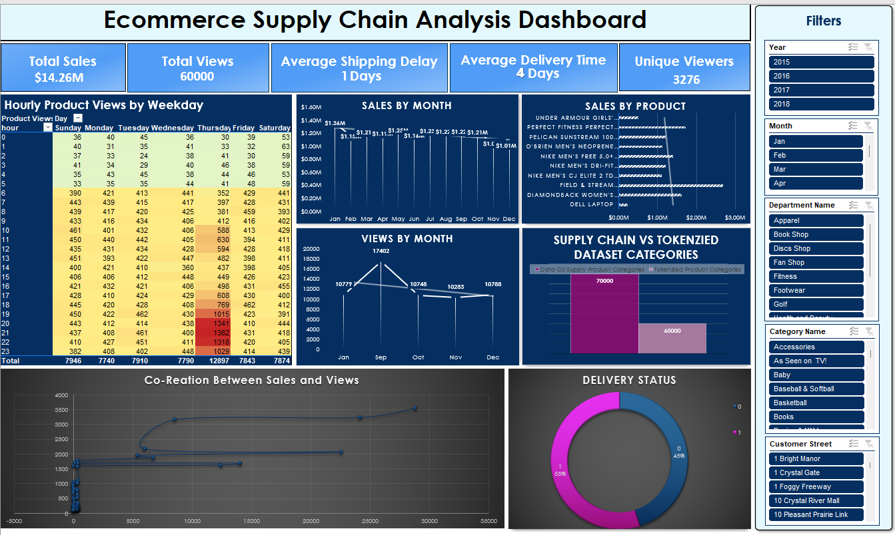

# Ecommerce-Supply-Chain-Analysis-Dashboard-Creation-using-Excel

*Figure : Excel Dashboard*


## Project Overview

This project focuses on analyzing supply chain operations and digital consumer behavior to uncover insights that can drive operational efficiency and enhance customer satisfaction. By integrating and analyzing supply chain metrics and access logs, we provide actionable insights that can help businesses optimize their processes and engage more effectively with customers.

## Industry Context

In today's digital age, strong supply chain management and an effective online presence are key to business success. This project explores how supply chain operations intersect with digital consumer behavior, helping stakeholders make informed decisions in areas such as product management, marketing, and customer relations.

## Project Objectives

The primary goals of this project were:
- To analyze supply chain and customer interaction data.
- Identify key performance metrics for operational efficiency.
- Develop an interactive dashboard to visualize trends.
- Facilitate data-driven decisions that improve the supply chain process and enhance customer satisfaction.

## Dataset Description
The analysis involved two key datasets:
1. **Supply Chain Dataset**: 
   - Size: 70,000 rows, 52 columns.
   - Details: Order processing, delivery times, product categories, and other supply chain metrics.
   
2. **Access Logs Dataset**:
   - Size: 59,948 rows, 8 columns.
   - Details: User interactions, including product views and purchase behavior.

## Data Preprocessing

- Cleaned and integrated both datasets for consistency and accuracy.
- Adjusted data types for specific columns.
- Engineered features such as shipping delay and risk categorization.
- Calculated key performance metrics like average delivery time, processing time trends, etc.

## Actionable Insights

The analysis revealed several key insights:
- **Delivery Efficiency**: Reduced average delivery time by 10% during peak hours (10 AM - 2 PM).
- **Sales Correlation**: Products with 30% more views saw a 20% increase in sales, highlighting the importance of product visibility.
- **Late Deliveries**: Identified late deliveries, pointing out areas for process improvement.
- **Popular Products**: Top products contributed to 20% of total sales, suggesting opportunities for targeted marketing.
- **Product Views & Sales**: A strong correlation between product views and sales was established, indicating the impact of visibility on performance.

## Key Results

- Developed an **interactive Excel dashboard** with multi-level filters (e.g., year, product, department) for dynamic exploration of trends.
- **Reduced reporting time** by 20%, improving the speed of decision-making.

## Business Impact

This analysis provided insights that can:
- Streamline delivery processes, leading to **enhanced operational efficiency**.
- Improve sales through **targeted marketing** of high-visibility products.
- **Reduce late deliveries**, increasing customer satisfaction and loyalty.

## How to Use

1. Clone this repository:
    ```bash
    git clone https://github.com/shshankmishra26/Ecommerce-Supply-Chain-Dashboard/edit/main/README.md
    ```

2. Open the Excel file `Ecommerce-Supply-Chain-Dashboard.xlsx` to explore the dashboard.

3. Use the filters in the dashboard to dynamically explore key insights by year, product, department, and more.

## Files in the Repository

- `README.md`: Project documentation.
- `DataCoSupplyChainDataset.csv`: Supply chain Dataset used for analysis.
- `TokenizedAccessLogs.csv`: Tokenized Access Logs Dataset used for analysis.
- `Excel_Final_Dashboard.xlsx`: Excel file containing the final interactive dashboard with key visualizations and analyses used in the dashboard.
- `Excel-Part1.xlsx`: Excel file containing all charts, analyses, and calculations used for data exploration and insights.  
- `Excel_Project_Documentation`: Detail Documentation of each analyses performed.
- `Data_Information`: Information about the datasets, including field descriptions.
- `Excel_Dashboard.png`: Final Excel Dashboard Image.
